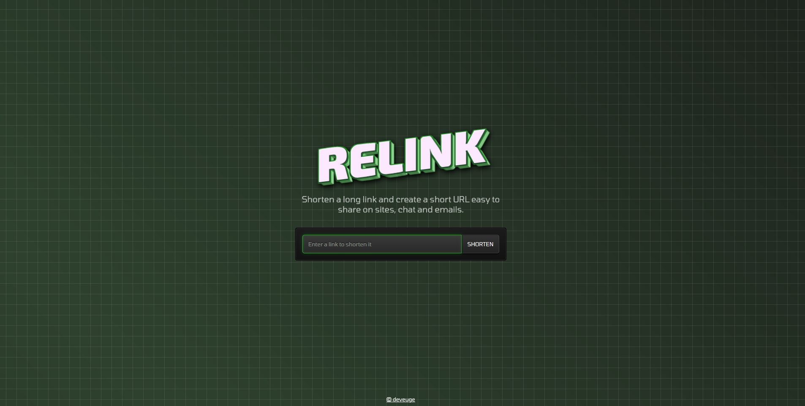
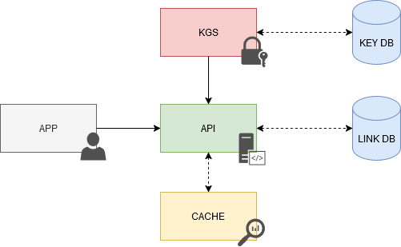

# Relink - URL Shortener



Relink is a Java Spring based shortening service consisting in:
* **Key Generation Service** (KGS): Allows the creation (and deletion) of hashes to be used in short urls. New and used hashes are stored in different tables.
* **API**: Entry point for using the service. Allows the creation, consultation and deletion of urls. Uses a Redis chache to avoid querying the database for those urls that are consulted the most. It also contains a scheduled task for the deletion of expired urls. Consumes the KGS module.
* **Application**: Visual interface for end users. Consumes the API module.



---

## Table of contents
  - [Concept](#concept)
    - [Functionality](#functionality)
  - [Requirements](#requirements)
    - [Functional Requirements](#functional-requirements)
    - [Non-Functional Requirements](#non-functional-requirements)
  - [System Analysis](#system-analysis)
    - [Components](#components)
    - [Capacity estimation](#capacity-estimation)
    - [High-level estimate](#high-level-estimate)
    - [Database Schema](#database-schema)
    - [Shortening Algorithm](#shortening-algorithm)
  - [URL Shortener API](#url-shortener-api)
    - [Create URL](#create-url)
    - [Get URL](#get-url)
    - [Delete URL](#delete-url)
  - [Cache](#cache)
  - [Bibliography](#bibliography)

## Concept
A URL shortening service is a website that significantly reduces the length of a Uniform Resource Locator (URL). The shortened URL then redirects the user to the original website’s URL. Well-known URL shortening services include [Tinyurl](tinyurl.com) and [Bitly](bitly.com).

### Functionality
At a high level, a URL shortener performs the following operations:

* The server creates a unique shortened URL for each original long URL.
* The server encodes the shortened URL for ease of readability.
* The server stores the shortened URL in the database.
* The server redirects the user to the original long URL using the shortened URL.

Reasons for shortening URLs:
* **Track clicks for analytics**: To monitor and analyze click data.
* **Beautify URLs**: To make URLs more aesthetically pleasing.
* **Disguise underlying URLs**: Often used by affiliates.
* **Character limits**: Some instant messaging services restrict the number of characters in a URL.
* **Ease of sharing**: Useful for sharing via SMS/tweets (where character limits apply) and when printed in books/magazines (fewer characters mean lower printing costs). Additionally, short URLs are easier and less error-prone to type compared to their longer counterparts.

## Requirements

### Functional Requirements
* When provided with a long URL, the service must create a shorter, unique alias.
* If different users input the same long URL, they should receive the same short URL (1-to-1 mapping).
* The short URL must be easy to read, free of collisions and not predictable.
* The service should redirect users to the original URL when they hit the short link.
* Links should expire after a default time span.
* Implement measures to prevent misuse of the service.

### Non-Functional Requirements
* Ensure high availability.
* Maintain low latency.
* Ensure high scalability.
* Maintain durability.
* Ensure fault tolerance.


## System Analysis
### Components
* **Client**: These are the web browsers that will interact with the backend servers through the HTTP protocol.
* **Load Balancer**: This component is responsible for evenly distributing the workload among the backend servers.
* **Web Servers** : Several web server instances will be deployed to facilitate horizontal scaling.
* **Database**: It will store the association between long URLs and their shortened counterparts.

### Capacity estimation
#### Traffic
Considering this system will be read-heavy, we will assume a 100:1 read/write ratio with 100 million links generated each month.
* Shortened links created per month: **100 million**.
* Requests Per Second (RPS): 100 million / (30 days * 24 hours * 3600 seconds ) = **~40 URLs/second**
* Number of redirections: 40 URLs/s * 100 = **4000 URLs/s**

#### Bandwidth
Since we anticipate around 40 URLs every second, and if we assume each request is approximately 500 bytes in size, the total incoming data for write requests would be: 
* 40 urls x 500 bytes = **20 KB/s**

Similarly, for read requests, with an expectation of about 4.000 redirections, the total outgoing data would be: 
* 4000 urls x  500 bytes = **~2MB/s**

#### Storage
We'll assume that each link or record in our database will be stored for 5 years. With an expectation of approximately 100 million new requests each month, the total number of records that will need to store would be:
* 100 million x 5 years x 12 months = **6 billion**

Assuming each stored record will be around 500 bytes (with an average URL length of 100 bytes), the total storage required will be approximately 3TB:
* 6 billion x 500 bytes = **3TB**

#### Cache
For caching, we will adopt the Pareto principle, also known as the 80/20 rule. This means that 80% of the requests are for 20% of the data, so we can cache approximately 20% of our requests.

Given that we expect around 4.000 read or redirection requests per second, this equates to roughly 350 million requests per day:
* 4000 URLs/second×24 hours×3600 seconds= **∼350 million requests/day**

Therefore, we will need around 35GB of memory per day for caching:
* 20% × 350 million requests × 500 bytes= **35 GB/day**

### High-level estimate
| Type                 | Estimate   |
| -------------------- | ---------- |
| Writes (New URLs)    | 40/s       |
| Reads (Redirection)  | 4K/s       |
| Bandwidth (Incoming) | 20 KB/s    |
| Bandwidth (Outgoing) | 2 MB/s     |
| Storage (5 years)    | 3 TB       |
| Memory (Caching)     | ~35 GB/day |

### Database Schema

Given that the data isn’t strongly relational, NoSQL databases like [Amazon DynamoDB](https://aws.amazon.com/es/dynamodb/), [Apache Cassandra](https://cassandra.apache.org/_/index.html), or [MongoDB](https://www.mongodb.com/es) would be more suitable. However, if an SQL database is needed, options like Azure SQL Database or Amazon RDS could be considered.
In our system, relational queries will be infrequent, so opting for a NoSQL database would simplify scaling.

Data Related to the **User**:
* **User ID**: A unique identifier or API key to make each user globally distinguishable.
* **Name**: The user’s name.
* **Email**: The user’s email address.

Data Related to the **Link**:
* **Hash**: A 7 character long unique short URL.
* **Original URL**: The original long URL.
* **User ID**: The unique identifier or API key of the user who created the short URL.
* **Expiration date**: The date on which the short URL will expire.

Additionally, we could use the originalUrl column as an index to improve query performance.

### Shortening Algorithm
#### Base62 Approach
In this method, we encode the original URL using Base62, which comprises uppercase letters (A-Z), lowercase letters (a-z), and digits (0-9) (26 + 26 + 10 = 62). 
With a 7-character short URL, we can generate 62^7 (~3500 billion) URLs, which is ample. We generate a random number for the long URL, convert it to Base62, and use this hash as the short URL ID. 
Assuming the service creates 4000 URLs/sec, it would take 27 years to exhaust the 3500 billion combinations:
* 4000 x 60 x 60 x 24 x 365 = 126.144.000.000 urls/year
* 3500 billion / 126.144.000.000 urls/year = **~27 years**

The longer the key, the more URLs available, reducing the risk of running out. However, **this simplest solution doesn't ensure non-duplicate or collision-free keys**.

#### MD5 Approach
The MD5 hash function generates a 128-bit hash (32 hexadecimal digits). We could use these to create a 7-character short URL:
* MD5(original url) → base62encode → hash

**This method risks duplication and collisions**. Recomputing the hash until finding a unique one increases system overhead, making this **less scalable**.

#### Counter Approach
Here, a single server maintains a count of generated keys. Each request increments the counter, yielding a unique number which is then Base62 encoded:
* Counter(0−3.5 trillion) → base62encode → hash

**This approach risks becoming a single point of failure**. Multiple instances can lead to collisions, needing a distributed system manager like Zookeeper for synchronization. Zookeeper can manage multiple ranges for servers, assigning new ranges as needed. This ensures unique, collision-free URLs, and multiple instances remove single points of failure.
* Range 1: 1 → 1.000.000​
* Range 2: 1.000.001 → 2.000.000​
* Range 3: 2.000.001 → 3.000.000​...

Once a server reaches its maximum range Zookeeper will assign an unused counter range to the new server. This approach can guarantee non-duplicate and collision-resistant URLs. Also, we can run multiple instances of Zookeeper to remove the single point of failure.

#### Key Generation Service (KGS)
A standalone Key Generation Service (KGS) generates unique keys ahead of time, storing them in a database for future use. Marking keys as used upon retrieval prevents reuse. Multiple server instances might try to use the same key, so KGS stores keys in two tables: one for unused keys and one for used keys. Upon use, keys move to the used table. KGS should ensure no key duplication among servers, requiring data structure synchronization.

To avoid KGS becoming a single point of failure, a standby replica can take over if the primary server fails. Background worker processes can generate Base62 random strings, verify uniqueness, and maintain a buffer of ready-to-use keys.

## URL Shortener API
The components in the system expose the Application Programming Interface (API) endpoints through Representational State Transfer ([REST](https://en.wikipedia.org/wiki/REST)) because of loose coupling and easiness to debug. We're using an API key to prevent abuse of our services. Using this API key we can limit the users to a certain number of requests per second or minute.

### Create URL
Creates a new short URL in our system given an original URL.

```
create(originalURL: string, expiration?: Date): string
```

* Parameters
    * **Original Url** (String): Original URL to be shortened.
    * **Expiration** (Date): Expiration date of the new URL (optional).
* Returns
    * **Hash** (String): New shortened URL.

### Get URL
Retrieves the original URL from a given short URL.

```
get(shortURL: String): string
```

* Parameters
    * **API Key** (String): API key provided by the user.
    * **Hash** (String): Short URL mapped to the original URL.
* Returns
    * **Original URL** (String): Original URL to be retrieved.

### Delete URL
Deletes a given shor tURL from our system.

```
delete(shortURL: string): boolean
```

* Parameters
    * **Hash** (String): Short URL to be deleted.
* Returns
    * **Result** (boolean): Represents whether the operation was successful or not.


> **NOTE:**  The access to the API will require authentication (an API key) as a token header name ("X-API-KEY") in each request.

## Cache
We can cache URLs that are frequently accessed. We can use some off-the-shelf solution like [Redis](https://redis.io/), which can store full URLs with their respective hashes. Before hitting backend storage, the application servers can quickly check if the cache has the desired URL.

---
## Bibliography
- [https://www.geeksforgeeks.org/system-design-url-shortening-service/](https://www.geeksforgeeks.org/system-design-url-shortening-service/)
- [https://medium.com/@sandeep4.verma/system-design-scalable-url-shortener-service-like-tinyurl-106f30f23a82](https://medium.com/@sandeep4.verma/system-design-scalable-url-shortener-service-like-tinyurl-106f30f23a82)
- [https://dev.to/karanpratapsingh/system-design-url-shortener-10i5](https://dev.to/karanpratapsingh/system-design-url-shortener-10i5)
- [https://www.enjoyalgorithms.com/blog/design-a-url-shortening-service-like-tiny-url](https://www.enjoyalgorithms.com/blog/design-a-url-shortening-service-like-tiny-url)
- [https://systemdesign.one/url-shortening-system-design/#url-shortener-api](https://systemdesign.one/url-shortening-system-design/#url-shortener-api)
- [https://sagarvasa.medium.com/url-shortener-service-a-basic-system-design-approach-96c9c371c197](https://sagarvasa.medium.com/url-shortener-service-a-basic-system-design-approach-96c9c371c197)
- [https://monday9pm.com/building-a-url-shorter-server-part-1-dancing-with-base62-de1af40f604c](https://monday9pm.com/building-a-url-shorter-server-part-1-dancing-with-base62-de1af40f604c)